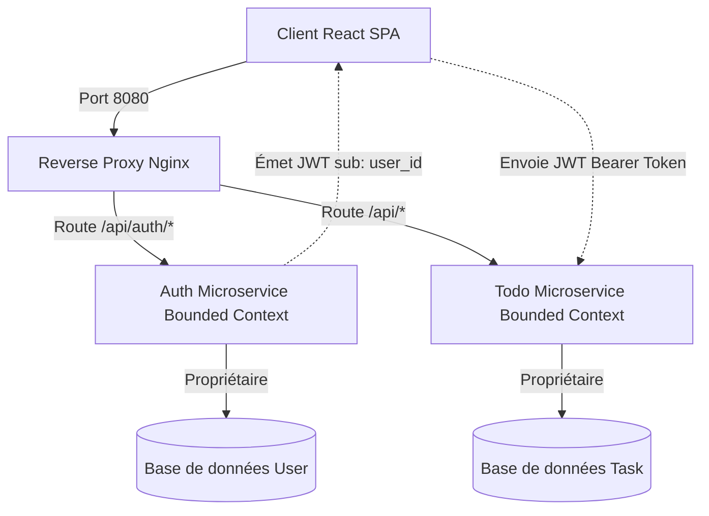
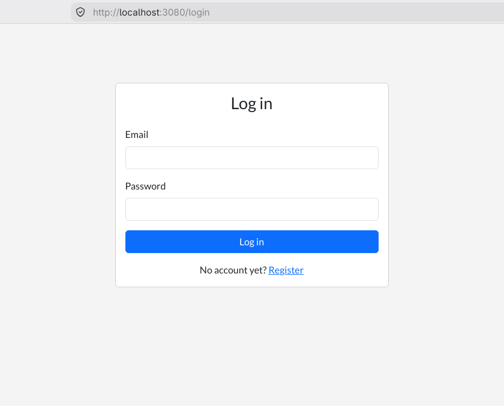
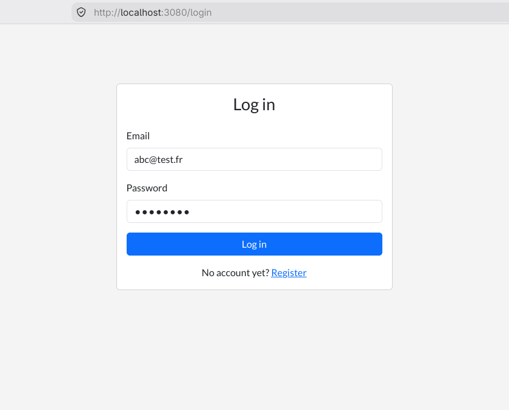
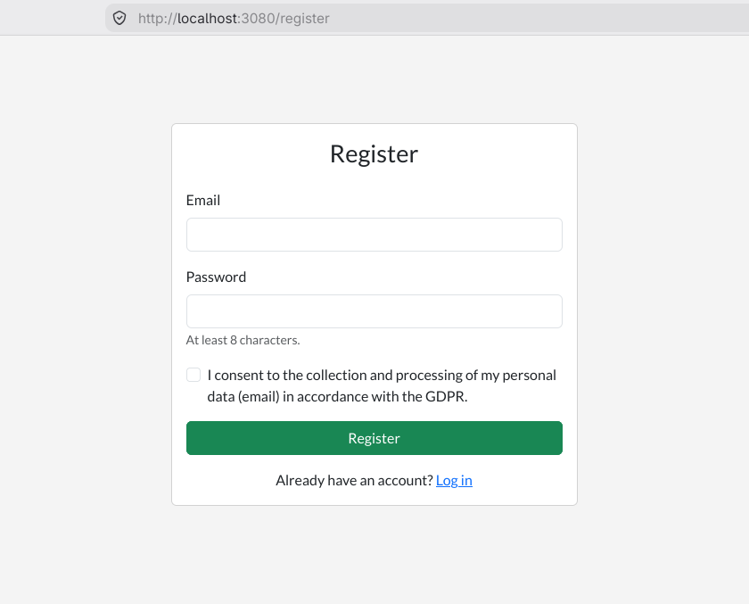
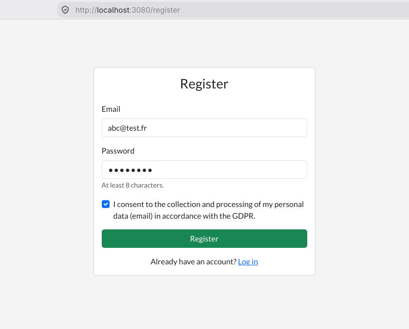
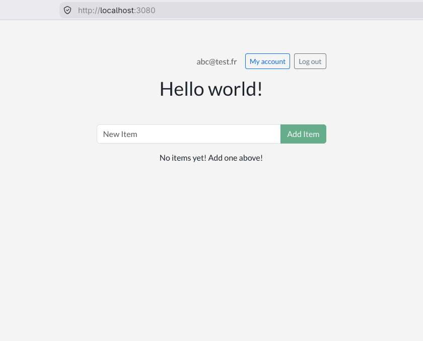
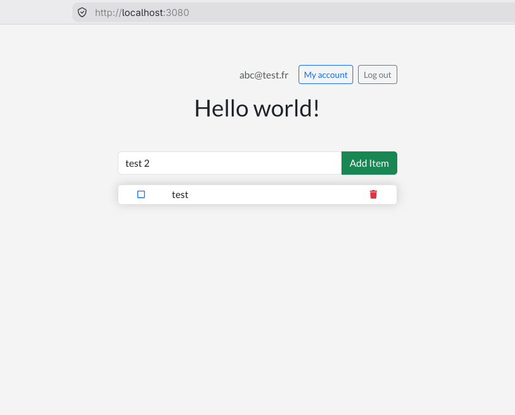
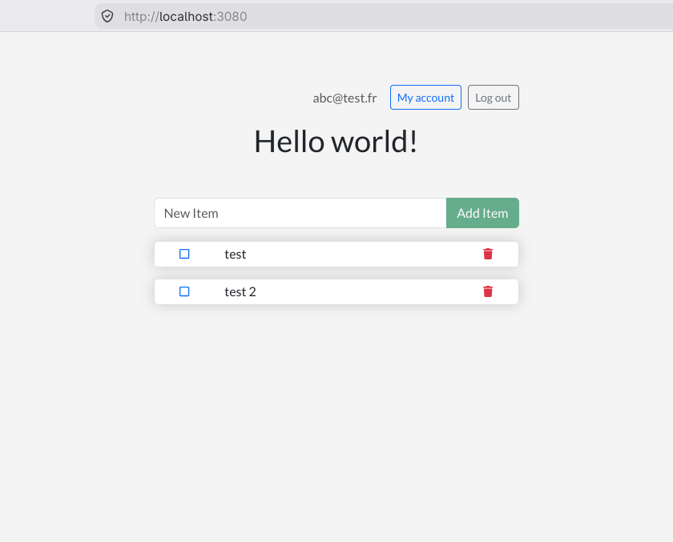
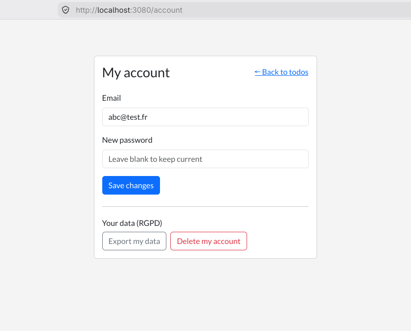

# Context Map

Ce chapitre présente la cartographie applicative de l'application : la structure globale du monorepo, l'organisation en microservices, les technologies utilisées et les limites des contextes métier (Bounded Contexts).

## Bounded Contexts (Contextes Métier)

### Contexte d'Authentification (Auth Service)

- **Responsabilité** : Gestion du cycle de vie des comptes utilisateurs (création, connexion, modifications du profil) et conformité RGPD (portabilité des données utilisateur et suppression définitive du compte).
- **Modèle de données** : Gère la table `users` dans sa base de données dédiée (`auth`).
- **Langage omniprésent** : _User, Email, Password Hash, Register, Login, Export, Delete Account._

### Contexte des Tâches (Todo Service / Backend)

- **Responsabilité** : Gestion de la liste de tâches des utilisateurs (création, mise à jour de l'état complété, filtrage, suppression globale).
- **Modèle de données** : Gère la table `todo_items` dans sa base de données dédiée (`todos`).
- **Langage omniprésent** : _Todo Item, Task Name, Completed State, Owner (user_id)._

---

## Relations entre les Contextes (Upstream/Downstream)

### Relation : Client-Side Orchestration (Partage Asymétrique)

- **Amont (Upstream - Auth)** -> **Aval (Downstream - Todo)**.
- **Mécanisme de liaison** : L'intégration se fait via des **JSON Web Tokens (JWT)**. Le service d'authentification (amont) génère le jeton signé contenant l'identifiant de l'utilisateur (`sub: user_id`). Le service de tâches (aval) vérifie le jeton à l'aide d'un secret partagé (`JWT_SECRET`) pour autoriser et associer les tâches créées à cet utilisateur.
- **Aucun appel direct réseau** : Le backend Todo ne contacte jamais le service Auth par réseau lors des requêtes HTTP normales. Il décode le JWT de façon autonome.
- **Purge RGPD** : Lors de la suppression de compte, c'est le client React qui orchestre de façon synchrone les appels de suppression successive (d'abord `DELETE /api/items` pour vider les todos, puis `DELETE /api/auth/me` pour supprimer l'utilisateur), évitant la présence d'éléments orphelins dans la base de tâches.

---

## Présentation du Prototype & Spécificités Ergonomiques (C2.2.1)

Le prototype réalisé est une **Single Page Application (SPA)** développée avec **React 19** et **TypeScript**. Il cible des environnements multi-équipements (Web de bureau, tablettes et terminaux mobiles) grâce à une structure d'interface entièrement responsive utilisant le système de grille fluide de **React-Bootstrap** et du CSS personnalisé.

### Interface d'Authentification (Mire de Connexion et Inscription)

L'accès à l'application est protégé. L'interface propose deux parcours simples, sémantiques et conformes aux bonnes pratiques d'accessibilité (champs de saisie liés à leurs libellés HTML).

- **Connexion** : L'utilisateur fournit son adresse email et son mot de passe.
  - _État initial_ : Le formulaire est vide et l'action de soumission est désactivée tant que les critères minimaux ne sont pas remplis.
  - _Saisie complétée_ : Le bouton "Se connecter" s'active et passe au bleu primaire, guidant visuellement l'utilisateur.

|        Formulaire de connexion vide         |         Formulaire de connexion complété          |
| :-----------------------------------------: | :-----------------------------------------------: |
|  |  |

- **Inscription** : Pour s'enregistrer, un email et un mot de passe fort sont requis.
  - _Conformité RGPD_ : L'inscription intègre une case à cocher explicite de consentement pour le traitement des données personnelles, bloquant la validation si elle n'est pas cochée.

|                 Inscription vide                 |                 Inscription complétée                  |
| :----------------------------------------------: | :----------------------------------------------------: |
|  |  |

---

### Tableau de Bord (Gestion de la Liste de Tâches)

Une fois connecté, l'utilisateur est redirigé vers son tableau de bord personnel. La navigation est conçue pour limiter la charge cognitive et permettre une interaction rapide, au clavier comme à la souris.

- **État vide (Empty State)** : Conformément aux recommandations OPQUAST, si l'utilisateur n'a aucune tâche, un message informatif et imagé l'invite chaleureusement à saisir sa première note.
- **Saisie dynamique** : L'interface permet d'écrire le titre d'une tâche. Une validation en temps réel bloque la saisie de chaînes vides.
- **Liste interactive** : Chaque tâche apparaît sous forme de ligne avec deux contrôles d'accessibilité (des boutons d'icône équipés d'attributs `aria-label` dynamiques pour la lecture vocale). La tâche peut être cochée (elle apparaît alors barrée) ou supprimée (clic sur l'icône de corbeille).

|               Dashboard vide                |                Saisie en cours                |               Liste de tâches active                |
| :-----------------------------------------: | :-------------------------------------------: | :-------------------------------------------------: |
|  |  |  |

---

### Espace de Gestion de Compte (Conformité RGPD & Sécurité)

Une page dédiée « Mon Compte » permet à l'utilisateur de gérer ses informations et d'exercer ses droits réglementaires :

- **Évolutivité des informations** : Modification sécurisée de l'adresse email et du mot de passe en cours de session.
- **Portabilité des données (RGPD - Art. 20)** : Un bouton permet d'exporter instantanément toutes les données détenues (profil et ensemble des tâches associées) sous format structuré JSON.
- **Droit à l'oubli (RGPD - Art. 17)** : Un bouton de suppression définitive permet d'effacer le profil de la base d'authentification et de purger toutes ses tâches en base de données, sans laisser d'éléments orphelins.

| Page de gestion de compte et exercice du RGPD |
| :-------------------------------------------: |
|     |
