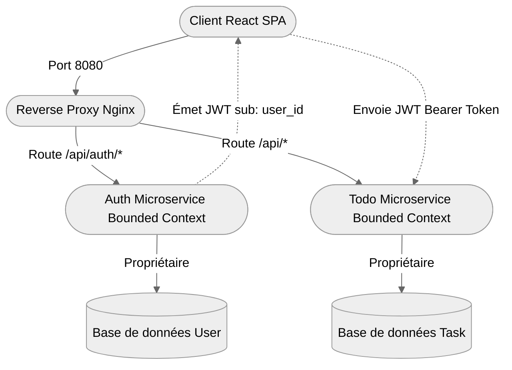

# Context Map

Ce chapitre présente la cartographie applicative de l'application : la structure globale du monorepo, l'organisation en microservices, les technologies utilisées et les limites des contextes métier (Bounded Contexts).

## Bounded Contexts (Contextes Métier)

### Contexte d'Authentification (Auth Service)

- **Responsabilité** : Gestion du cycle de vie des comptes utilisateurs (création, connexion, modifications du profil) et conformité RGPD (portabilité des données utilisateur et suppression définitive du compte).
- **Modèle de données** : Gère la table `users` dans sa base de données dédiée (`auth`).
- **Langage omniprésent** : _User, Email, Password Hash, Register, Login, Export, Delete Account._

### Contexte des Tâches (Todo Service / Backend)

- **Responsabilité** : Gestion de la liste de tâches des utilisateurs (création, mise à jour de l'état complété, filtrage, suppression globale).
- **Modèle de données** : Gère la table `todo_items` dans sa base de données dédiée (`todos`).
- **Langage omniprésent** : _Todo Item, Task Name, Completed State, Owner (user_id)._

## Relations entre les Contextes (Upstream/Downstream)

### Relation : Client-Side Orchestration (Partage Asymétrique)

- **Amont (Upstream - Auth)** -> **Aval (Downstream - Todo)**.
- **Mécanisme de liaison** : L'intégration se fait via des **JSON Web Tokens (JWT)**. Le service d'authentification (amont) génère le jeton signé contenant l'identifiant de l'utilisateur (`sub: user_id`). Le service de tâches (aval) vérifie le jeton à l'aide d'un secret partagé (`JWT_SECRET`) pour autoriser et associer les tâches créées à cet utilisateur.
- **Aucun appel direct réseau** : Le backend Todo ne contacte jamais le service Auth par réseau lors des requêtes HTTP normales. Il décode le JWT de façon autonome.
- **Purge RGPD** : Lors de la suppression de compte, c'est le client React qui orchestre de façon synchrone les appels de suppression successive (d'abord `DELETE /api/items` pour vider les todos, puis `DELETE /api/auth/me` pour supprimer l'utilisateur), évitant la présence d'éléments orphelins dans la base de tâches.
