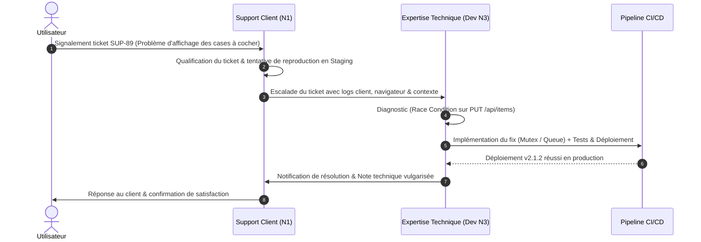

## 3.1. Contexte et Collaboration avec le Support Client (C4.3.3)

Le maintien de l'attractivité du logiciel passe par une écoute active des retours utilisateurs et une synergie étroite entre l'équipe d'assistance (Support N1/N2) et l'équipe d'ingénierie logicielle (Niveau 3 - Expertise Technique).

### 3.1.1. Processus d'Escalade et Répartition des Rôles

**Matrice de Responsabilités :**

- **Support Client (Niveau 1 / N2) :** Accueil du client, enregistrement du ticket, collecte des métadonnées (navigateur, OS, captures), première qualification de la sévérité et reproduction initiale.
- **Expertise Technique (Niveau 3 / DevSecOps) :** Analyse approfondie de la cause racine (logs, traces réseau), développement du correctif, rédaction des tests unitaires/E2E et validation du déploiement via CI/CD.

### 3.1.2. Fiche de Ticket de Support Escaladé (Ticket SUP-89)

| Champ                 | Contenu                                                                                                                                                              |
| :-------------------- | :------------------------------------------------------------------------------------------------------------------------------------------------------------------- |
| **ID Ticket Support** | SUP-89 (Escaladé en DEV-402)                                                                                                                                         |
| **Client / Origine**  | Client Professionnel (Compte Enterprise)                                                                                                                             |
| **Symptôme Client**   | _"Lorsque je coche plusieurs tâches rapidement à la suite, l'interface clignote et certaines tâches repassent en statut 'non terminé' quelques secondes plus tard."_ |
| **Qualification N1**  | Reproduit sur Chrome 126. Erreur intermittente lors de manipulations rapides. Sévérité : Moyenne (Gêne d'utilisation).                                               |

### 3.1.3. Analyse et Expertise Technique (Niveau 3)

L'analyse des requêtes réseau par l'ingénieur développeur a révélé un problème de **Race Condition (Concurrence de requêtes)** :

- Le client React envoyait des requêtes `PUT /api/items/:id` de manière asynchrone à chaque clic sans attendre la réponse du serveur pour mettre à jour l'interface (Optimistic UI).
- En cas de clics successifs rapides, si la requête N°2 était traitée par le backend avant la fin de l'écriture en BDD de la requête N°1, l'état global renvoyé par le serveur écrasait l'état local du client avec des données obsolètes.

### 3.1.4. Résolution Technique Apportée

Un correctif technique a été implémenté sur le Frontend React :

1. **Mise en place d'un Mutex / Debounce Queue :** Les appels API de modification d'état sont désormais sérialisés dans une file d'attente pour garantir leur ordre d'exécution strict.
2. **Synchronisation d'état robuste :** L'interface utilisateur ne confirme définitivement l'état coché qu'à la réception du statut `200 OK`, avec annulation visuelle automatique en cas d'échec HTTP.

### 3.1.5. Clôture et Communication Vulgarisée

Une fois le correctif déployé en production (version `v2.1.2`), l'ingénieur dev a transmis une note d'explication au support pour réponse au client :

> _"Bonjour, merci pour votre retour précieux. Nos ingénieurs ont identifié qu'une synchronisation simultanée trop rapide avec nos serveurs provoquait un chevauchement des données lors de clics successifs. Un correctif a été déployé. Votre liste de tâches est désormais parfaitement réactive, même à grande vitesse. N'hésitez pas à rafraîchir votre page pour en bénéficier."_

Cette collaboration fluide entre le support et l'équipe technique a permis de transformer un dysfonctionnement frustrant en une amélioration pérenne de la qualité logicielle.
